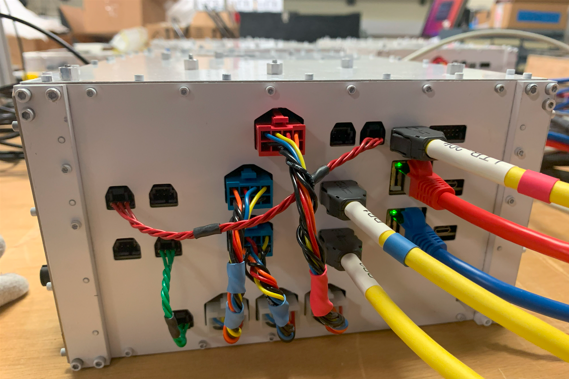

# Umbrella Installation Instructions

[standoff 10-32 x .281 L]: https://www.mcmaster.com/91780A450/
[standoff 10-32 x .313 L]: https://www.mcmaster.com/91780A453/
[standoff 10-32 x .344 L]: https://www.mcmaster.com/91780A456/
[washer no 10 .688 OD]: https://www.mcmaster.com/90313A103/
[washer no 10 .75 OD]: https://www.mcmaster.com/90313A400/
[washer no 10 .354 OD 1x]: https://www.mcmaster.com/5360N124/
[washer no 10 .354 OD 2x]: https://www.mcmaster.com/5360N125/
[Hookup Scheme]: https://gaps1.astro.ucla.edu/wiki/gaps/images/gaps/9/94/TOF_Hookup_Scheme.pptx
[TOF Cabling]: https://gaps1.astro.ucla.edu/wiki/gaps/index.php?title=TOF_Cabling
[PDU Cable Hookup]: https://docs.google.com/spreadsheets/d/1JeqscofEl3fJpouw6M_YKk_H6MmpS8kUMCTMPxKX2ig/edit?usp=sharing

* [TOF Hookup scheme][Hookup Scheme]
* [TOF Cabling]
* [PDU Cable Hookup]

There are 4 main components to installing the Umbrella.

1. Installing the RATs
2. Installing the TOF panels
3. Routing cables from Panels to RATs
4. Routing RAT to TOF-SYS "umbilical" cables through the Umbrella

There is not a one-size-fit-all procedure for when to install a RAT
before a panel, or vise-versa.  You'll need to adopt a procedure that
allows you to have adequate access to the various components.  Using
panels 10 and 11 as examples, I would first mount panel 10 followed by
panel 11.  Then mount RATs 2 and 4, and route the "umbilical" cables.
Now, route and connect all the cables between the panel and RAT.  All
cables should be stress relieved to the Gondola as soon as possible.

I recommend installing RATs before any of the TOF panels, and the
remaining major components (2-4) should be installed in an order where
the installer still has access.  Typically one would mount the TOF panel
and then route all the relevant cables from the panel to the associated
RAT.  The umbilical cables need to routed across the UMB frame and
down the diagonals of the UMB frame.

The Umbrella is composed of 6 RATs numbered 1-6 and 7 TOF panels
numbered 7 - 13, see image below.  The image also shows which paddles
in which panels get connect to which RAT.  For example, paddle 79 in
panel 09 get connected to RAT 05.


## Mounting RATs

### Required Hardware

[92200A340]: https://www.mcmaster.com/92200A340/
[92865A006]: https://www.mcmaster.com/92865A006/
[91525A118]: https://www.mcmaster.com/91525A118/

|       Component       | McMaster PN |   Torque   | Description                            |
|:---------------------:|:-----------:|:----------:|:---------------------------------------|
| SHCS, 10-32 x .375" L | [92200A340] | 30 in-lbs  | Mil. Spec., attaches RAT to mount      |
|  HHCS, 1/4-28 x .75"  | [92865A006] | 115 in-lbs | Grade 5, attaches RAT mount to gondola |
|   WASHER, for 1/4"    | [91525A118] |            | SS316, attaches RAT mount to gondola   |

### Mounting

[RAT UMB Mount BOM/Assembly](https://gaps1.astro.ucla.edu/nextcloud/index.php/f/13505)

1. First attach the side jumper wires.  There is a bag co-located with each RAT
   that has all the jumper wires.  Make sure the colored ends are connected
   as they are depicted below.  **THESE WIRES CAN NOT BE FLIPPED.**  Note that
   the two banded blue cable goes to the top RB and the single banded blue cable
   goes to the lower RB.  The solid green and red wire bundles are I2C lines,
   so they are not orientation restricted.
   
   

2. Using 6x 10-32 SHCS [92200A340], attach the RAT to the RAT UMB mount.  These
   6 screws come from under the mount and screw into the bottom of the RAT.
   Torque to **30 in-lbs**.
3. Now you're ready to attach the RAT to the gondola.  If you have already
   attached the TOF panel, then place a piece of foam on the TOF panel to
   protect it.
4. The whole RAT unit attaches to the gondola using 4x 1/4"-28 screws.  Use
   a stack of the 1/4"-28 screw ([92865A006]) and washer [91525A118].  It is
   tight quarters to get the screws in, but the mount was design with enough
   clearance if you use a 7/16" socket with a 6" extension.  Torque to 
   **115 in-lbs**.
5. Connect and route the umbilical cables, this should happen before connecting
   and routing the panel cables.  The umbilical cables include:
   
   - 1x blue ethernet
   - 1x red ethernet
   - 1x Y-split Harting cable (goes to RBs)
   - 1x normal Harting cable (goes to LTB)
   - 1x PDU cable
   
   All these cable are labeled and stored in the yellow pelican-like cases.
   
   Refer to the above image for hookup.

6. The umbilical cables need to strain relieved and zip-tied to the gondola
   frame as soon as possible.  The following table indicates which diagonal
   the umbilical cables should be routed to...

| RAT |     PDU      |   Ethernet   |   Hartings   |
|:---:|:------------:|:------------:|:------------:|
|  1  | SOL/Non-Boom | SOL/Non-Boom | SOL/Non-Boom |
|  2  |   RAD/Boom   | RAD/Non-Boom | RAD/Non-Boom |
|  3  | SOL/Non-Boom | SOL/Non-Boom | SOL/Non-Boom |
|  4  | RAD/Non-Boom | RAD/Non-Boom | RAD/Non-Boom |
|  5  | RAD/Non-Boom | RAD/Non-Boom | RAD/Non-Boom |
|  6  |   SOL/Boom   |   SOL/Boom   |   SOL/Boom   |


## Installing TOF Panels

- The UMB TOF panels do not all sit in the same plane, so the order of
  installation matters.  In fact, the umbrella is staggered in 4 layers:

  1. **Top Layer** - Panels 10 & 13
  2. **T - 1** - Panels 8 & 11
  3. **T - 2** - Panels 9 & 12
  4. **T - 3** - Panels 7

- All the listed aluminum nuts/standoffs for mounting panels are .313" L
  ([91780A453][standoff 10-32 x .313 L]), but you can use 9/32" L
  (.281" - [91780A450][standoff 10-32 x .281 L]) and 11/32" L 
  (.344" - [91780A456][standoff 10-32 x .344 L]) standoffs in their place.
- **WHENEVER YOU'RE TIGHTENING A FASTENER NEXT TO A PADDLE DO NOT USE A
  WRENCH, INSTEAD USE A SOCKET.**  This could be a 5/16" socket on a
  driver or a ratchet.  If you have to deal with a threaded road or a
  long screw, then use the [pass-through wrench](https://a.co/d/jaLb467).
- Always creep up on a torque spec!!  **WHEN IN DOUBT, STOP TORQUING AND
  GET A SECOND OPINION FOR SOMEONE WITH EXPERIENCE.**  We do NOT have
  spares for UMB mounts, so a stripped tap or broken screw will set us
  back for a significant period of time.

### How to Identify a Panel

* Every paddle has 3x QR code stickers attached.  There is one on the
  backside of each SiPM module, and one on the paddle face.  The one
  on the paddle face marks the A side of the paddle.  This will help
  you reference the paddles in the image above.
* The QR code stickers have both a QR code and the Paddle ID.  The QR
  should link you to the calibration data for the paddle.  The Paddle
  ID is also the number depicted in the image above.
* The paddles in a paddle overlap each other, which creates two planes
  of paddles.  The lower plane is the one that rests on the CF sandwich
  panel and the upper plane is the one touching the Top Straps.
* The "first" paddle in a panel corresponds to where the first lower
  plane paddle runs along the edge of the paddles.  For example, for
  Panel \#7 this corresponds to paddle 61 (see image above).  We often
  refer to this as the top of the panel.
* The paddle at the top of a panel will always be the one with the lowest
  paddle ID and the paddle IDs will sequentially count to the bottom
  of the panel.
* Each panel should have white stickers on the one of the Top Straps to
  indicate it Panel ID (PID).  This was a practice instituted partially
  through construction, so all panels may not have these stickers yet.
  If the stickers are not present, then the top of the penal will have
  a piece of blue tape indicated the PID.

### How to Read Panel Cables

Every SMA and PWR cable that connects a panel to a RAT is labelled on
both ends with a scheme that indicates where the cable connects at the
panel and where the cable connects at the RAT.  A detailed explanation
of this scheme can be found on the GAPS Wiki, [TOF Cabling].

As an example, let's take the label `RAT0109-PO7-062A-LG`.  The last
part `LG` tells us this is a low-gain channel, which connect to the
center SMA of the SiPM module and the LTB in the RAT.  The first part
`RAT0109` tells us the cable connects to RAT01 and to channel 9 of the
LTB.  A high-gain `HG` cable would connect to the readout boards RB.
The center part of the label `P07-062A` tells us the cable connects to
the A-side of paddle 62, which is located in panel 7.

While looking at the face of a RAT, the channel numbers look like...

``` bash
|--------------------------------------------------------------------------------------------|
|                                                                                            |
| LTB  (01) (02) (03) (04) (05) (06) (07) (08)     (09) (10) (11) (12) (13) (14) (15) (16)   |
|                                                                                            |
| RB1  (01) (02) (03) (04) (05) (06) (07) (08)                                               |
|                                                                                            |
| RB2  (09) (10) (11) (12) (13) (14) (15) (16)                                               |
|                                                                                            |
| PB       (02)      (04)      (06)      (08)           (10)      (12)      (14)      (16)   |
|     (01)      (03)      (05)      (07)           (09)      (11)      (13)      (15)        |
|                                                                                            |
|--------------------------------------------------------------------------------------------|
```

### Assembly Schematics

[Panel 10 & 13 PDF]: https://gaps1.astro.ucla.edu/nextcloud/index.php/f/8753
[Panel 8 & 11 PDF]: https://gaps1.astro.ucla.edu/nextcloud/index.php/f/8756
[Panel 9 & 12 PDF]: https://gaps1.astro.ucla.edu/nextcloud/index.php/f/8757
[Panel 7 PDF]: https://gaps1.astro.ucla.edu/nextcloud/index.php/f/8758

I've generated assembly/BOM documents for each mounting variations.  These
documents have exploded views of the mounts, list of components, and
torque specs.  All the documents are on the GAPS NextCloud, and I'm linking
them below:

* [Panel 10 & 13 PDF]
* [Panel 8 & 11 PDF]
* [Panel 9 & 12 PDF] 
* [Panel 7 PDF]

### Installation Instructions

**NOTE:** Currently we only have QTY 24 of the load spreaders `TOF-PAN-011`.
I have another QTY 24 in production and scheduled to be delivered on 10/31
([track](https://www.fedex.com/apps/fedextrack/?action=track&trackingnumber=785639662959)).
Until all the load spreaders arrive, reserve what we have for inboard mounts and
panel 7 mounts.  It won't be difficult to replace outboard mounts before the
whole frame is lifted.

1. Before installing any panels, attach the mounting bars to the gondola.
   Reference the assembly PDF's linked in [Assembly Schematics](#assembly-schematics).
   * This needs to be done first, since some bars have never been mounted and we
     need to ensure that all tapped holes are deep enough to accept the hardware.
   * You don't need to torque the fasteners in this step, just make them hand
     tight.
   * If a tapped hole does NOT have enough threads, then it needs to be tapped
     further.  Take a BOTTOM/BUTT tap and cut a few more threads.  A FLUTE tap
     will likely not work for this step, but a PLUG tap might work.
   * If tapping still does not work, then use either a
     [5360N124][washer no 10 .354 OD 1x] or
     [5360N125][washer no 10 .354 OD 2x], with the latter being the
     thicker one.  Use only one washer and side with using the thinner one.
2. 
